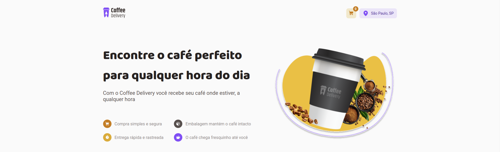
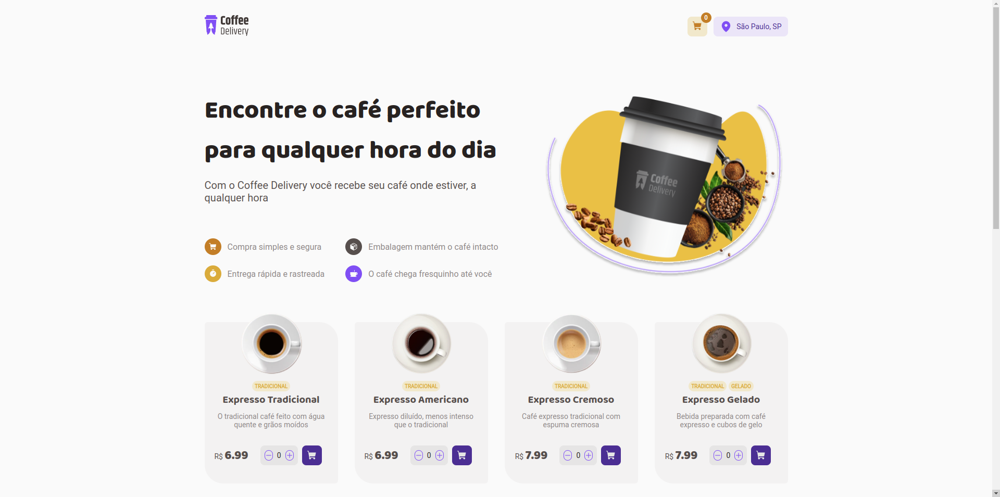
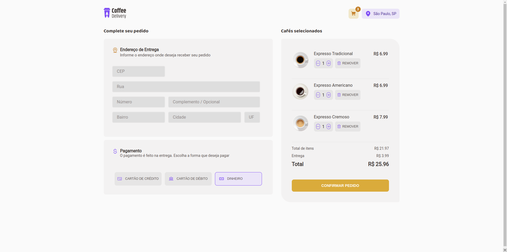
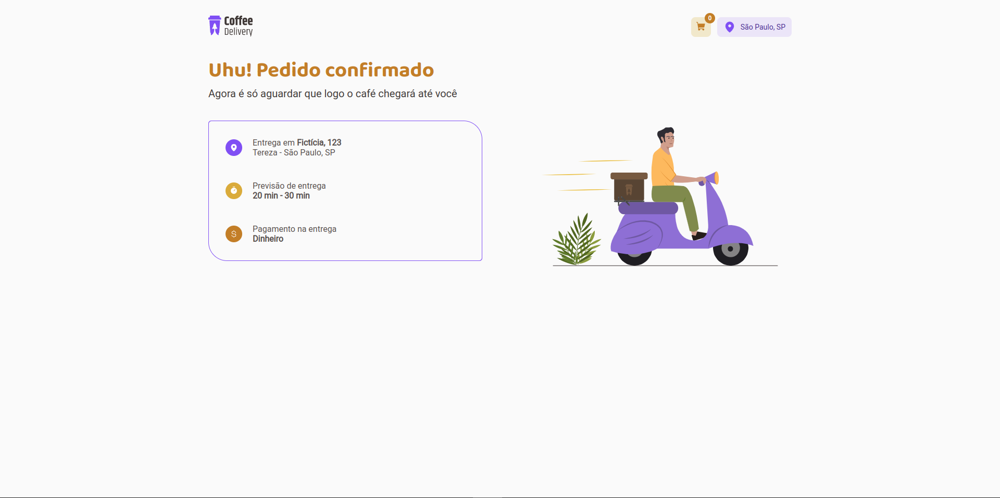

# Coffee Delivery


Aplicação web que desenvolvi com a maioria das funcionalidades de um e-commerce 💻

## 📄 Índice 

- <h3>Funcionalidades do projeto</h3>
- <h3>Tecnologias utilizadas</h3>
- <h3>Layout</h3>
- <h3>Demonstração</h3>
- <h3>Como rodar o projeto</h3>
- <h3>Perfil</h3>

## 🛠 Funcionalidades do projeto

- [x] Carrinho de compras
- [x] Endereço de entrega
- [x] Cardápio de cafés
- [x] Concluir pedido
- [x] Forma de pagamento (não contém cadastro de cartão)

## 📲 Tecnologias utilizadas

- ReactJS
- Typescript
- Phosphor-react
- Reaact-Toastify
- React Hookform
- React-router-dom
- Styled-components

## 🧱 Layout





## 🖥 Demonstração

# https://coffeedelivery-psi.vercel.app/

## 💿 Como rodar o projeto

```bash
# clone este repositório

$ git clone linkrepo

# Acesse a pasta do projeto no seu terminal

$ cd coffee-delivery

# Instale as dependências

$ npm install

# Execute a aplicação

$ npm run dev

# A Aplicação será iniciada na porta 3000
# http://localhost:3000

```

# Perfil


## https://www.linkedin.com/in/nicolas-prudencio/